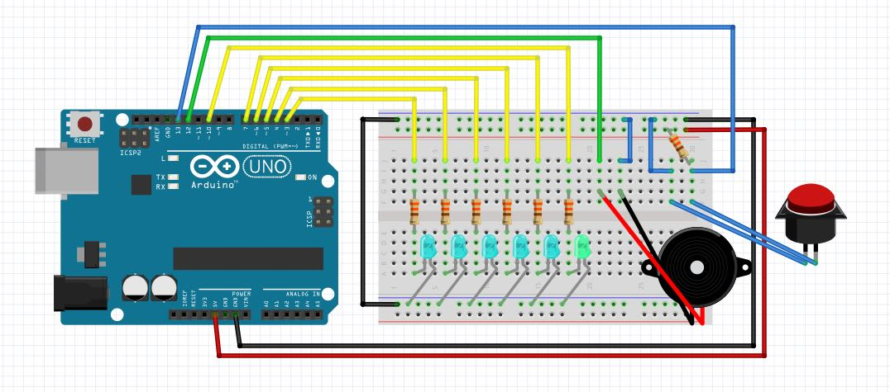

# Pomodoro Arduino
Pomodoro timer for the Arduino Uno. Built using the SparkFun RedBoard as part of a Shutterstock CodeRage.

## Pomodoro Technique
The [Pomodoro Technique](http://pomodorotechnique.com/) is a method of time management developed by Francesco Cirillo. Part of the technique uses a timer to divide the time spent on a task to intervals of 25 minutes (called *pomodoros*) separated by pauses of 5 minutes. This technique can be effective in today's world of software development, as it recognizes the frequent interruptions and has long periods of focused flow.

## Pomodoro Arduino
This sketch, when combined with the hardware layout defined in the schema, will create a pomodoro timer. Features include:
 - five LED lights that will show progress of the current pomodoro (5 minutes apiece)
 - a sixth LED light to show when the rest period should be honored
 - friendly buzzer to alert when each stage of the interval is complete
 - an acknowledge button to proceed from pomodoro -> rest -> pomodoro, etc
 - configurable options for tone, interval lengths, and rest lengths

## Schematic

## License
Pomodoro Arduino is licensed under the MIT license. See the [License File](LICENSE.md) for more information.
